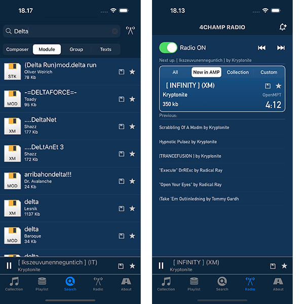

# 4champ

4champ is an app that provides a mobile interface to [Amiga Music Preservation](http://amp.dascene.net) database on iOS devices.

Many of us who grew up with computers in the 80's and early 90's remember Amiga and particularly its mind-blowing audio capabilities which were unrivaled at the era. Amiga inspired a lot of musicians to
produce a vast amount of compositions, or modules as they were called. [Amiga Music Preservation](http://amp.dascene.net) is a non-profit
project that collects anything related to Amiga music production. AMP database boasts over 160 000 modules, 4champ app is your direct access to all that goodness.

If you're interested to test new features when they're getting implemented before official App Store releases, you can join the beta program at https://testflight.apple.com/join/j1yhaJQ1.

You can read more about the history of the app and follow my work on the app at the development journal that I created for this project: [sitomani.github.io/4champ](https://sitomani.github.io/4champ).

You can also follow the [@4champ_app](https://twitter.com/4champ_app) Twitter account to stay up to date on what's happening with the app.

### Main Features of the app

- Search: Search the AMP database by module, composer, group name or sampletexts.
- Radio: You can listen to a random set of tunes from the whole collection of over 150000 modules, or stream from the head, i.e. the most recently added ones. You can also play from the local collection from set of modules that you've selected to keep for offline mode. 
- Playlists: Build your own playlists from modules.
- Local Collection: store modules locally - persistent storage for off-line listening of modules.
- Settings: Control stereo separation, sound interpolation etc.
- Import modules from filesystem (local / cloud / network)

### Dependencies

##### A. Frameworks configured through Swift Package Manager

**[Alamofire](https://github.com/Alamofire/Alamofire)** is used for network comms.
**[GzipSwift](https://github.com/1024jp/GzipSwift)** is used to unpack the gzipped module files.
**[SwiftyBeaver](https://github.com/SwiftyBeaver/SwiftyBeaver)** is used for logging.

##### B. Module Playback Libraries

4champ uses [libOpenMPT](https://github.com/OpenMPT/openmpt), [Hivelytracker](https://github.com/pete-gordon/hivelytracker) and [UADE](https://gitlab.com/sitomani/uade-ios) for module playback.

**Hivelytracker** replayer code is included in [4champ/Replay/Hively](4champ/replay/hively) folder, so it will be built automatically when you build xcode projects in this repository, no further actions needed.

**LibOpenMPT** repo does not build for iOS without small tweaks, which I have done on my own fork of the lib at https://github.com/sitomani/openmpt. In order to build it for use in connection with 4champ and the SamplePlayer demo app in this repository, you will need to take the following steps:

1. Make sure you have the [GENie](https://github.com/bkaradzic/GENie) project generator tool installed to your system
2. Clone https://github.com/sitomani/openmpt at same folder where you cloned this repository at (the repositories will be subfolders in same level in the directory tree).
3. Navigate in terminal to the openmpt repository root folder
4. Execute `iOS_genproject.sh` to generate the xcode project files for libopenmpt.
5. Execute `iOS_build.sh` to build the fat framework file for iOS use (supports simulators on both Intel and M1 macs and all Arm64 iOS devices)
6. After successful build, the framework file `libopenmpt.framework` will be found under openmpt repository root, and 4champ repository projects are configured to find it there, provided that you have cloned this repository and openmpt repository in the same folder.

**UADE** likewise, the UADE framework implementation is my port for iOS at https://gitlab.com/sitomani/uade-ios. Clone the repository in the same parent folder and build the framework following instructions in the cloned repository before building the app.

### Building the app

After setting up the dependencies you can open 4champ.xcodeproj in Xcode and build the application. On simulator you can run the app without any further changes.

In order to run the app on device, you will need to replace the bundle identifier with another id, because Xcode will create a development certificate on the fly for the device build and same bundle identifier cannot be present in multiple certificates.

The Xcode generated developer certificate will only be valid for 7 days, which means that you'll need to reinstall from Xcode every week to use the app. To work around this nuisance, you can create an ad hoc distribution certificate for signing the app in Apple Developer Center if you are a member of the Apple Developer Program.

### License

The code in this repository is copyright © Aleksi Sitomaniemi and dual licensed under [GPL](LICENSE.GPL) and [MIT](LICENSE.MIT), **except** for HivelyTracker replay routine code which is by licenced under [BSD-3](4champ/replay/hively/LICENSE) by [Pete Gordon](https://github.com/pete-gordon).

Module files included under _SamplePlayer_ test project that I've used to verify the the replay routines are work of the original authors:

_1st_intro.mod_ by florist (Aleksi Sitomaniemi - yup that's me!) 
_all.in.eightchannels.xm_ by Daze (Patrick Glasby-Baldwin) 
_jinx.jam_ by Jeff (Ingmar Hänsch) 
_mislead.ahx_ by Pink (Manfred Linzner) 
_peanuts!.hvl_ by Lavaburn (Dale Whinham) 
_sweet_dreams.aon_ by Toodeloo (Anders Nilsson) 
