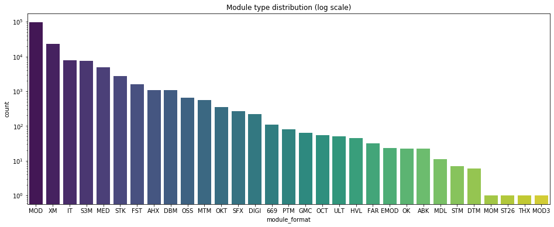

## Observation #01: Module Format Distribution

This graph shows the module type distribution in the AMP database, in log scale (as of 1.1.2020)

Formats that 4champ does not support are not included (e.g. the #pretracker mods are not in the graph even though there's some in the db)

For module type descriptions, see [AMP FAQ](http://amp.dascene.net/faq.php#03)

[TOC](ds_toc.md) | [Next](ds_02.md)