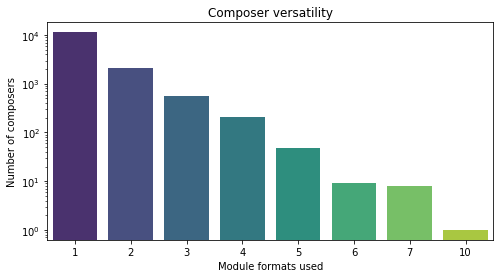

## Observation #02: Composer versatility

This graph shows the distribution of composer versatility in terms of different
module formats.

The majority of the composers concetrate on a single tracker and produce all their tracks in same format. However, there's some versatile composers that try many different trackers. 

In this graph, 10 formats is used by "UnknownComposers", which denotes all composers thathave not been identified or they have not wanted to be listed, so I'm counting that out of the real versatility test here.

There are seven (7) adventurous composers that have used up to 7 different formats in their modules. Note that they all have a different set of formats:

| Composer | Formats |
|----------|---------|
|[Aceman](http://amp.dascene.net/detail.php?view=9989)| 'AHX' 'DBM' 'FST' 'HVL' 'MED' 'MOD' 'XM'|
|[Kam](http://amp.dascene.net/detail.php?view=10134)| 'AHX' 'DBM' 'DIGI' 'HVL' 'IT' 'MOD' 'XM'|
|[Maelcum](http://amp.dascene.net/detail.php?view=4487)| '669' 'FAR' 'FST' 'MOD' 'MTM' 'S3M' 'XM'|
|[Neoj1n / CC Catch](http://amp.dascene.net/detail.php?view=988)| '669' 'FST' 'IT' 'MOD' 'MTM' 'S3M' 'STM'|
|[Nula](http://amp.dascene.net/detail.php?view=5458)| DBM' 'FST' 'IT' 'MED' 'MOD' 'S3M' 'XM'|
|[Robin](http://amp.dascene.net/detail.php?view=6285)| 'DBM' 'DIGI' 'IT' 'MED' 'MOD' 'OSS' 'XM'|
|[Voyager](http://amp.dascene.net/detail.php?view=8070)| 'AHX' 'DBM' 'DIGI' 'FST' 'MED' 'MOD' 'XM'|

[TOC](ds_toc.md) | [Prev](ds_01.md) | [Next](ds_03.md)
