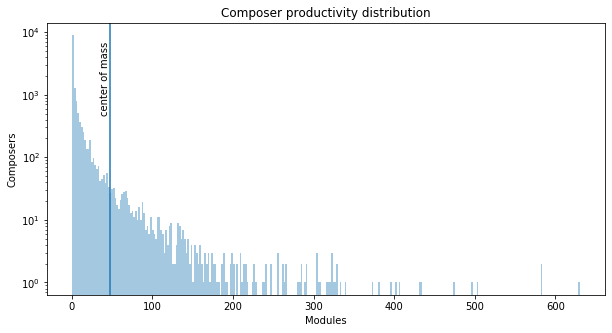

## Observation #03: Composer productivity distribution

In this plot, the composer productivity distribution. Some basic statistics in numbers:

* There are 14398 composers (AMP database has more, but I count here only those that have at least 1 module available)
* 5841 composers have only 1 module available
* 1 composer holds the record of 630 modules in the database (more about this on the next observation)
* The center of mass is marked on the graph at x axis value 48. 
   * This means that half of all the modules are produced by composers that have 48 or less modules in the database. There are 13731 such composers.
   * The other half is by 667 composers that have 49 or more modules.

[TOC](ds_toc.md) | [Prev](ds_02.md) | [Next](ds_04.md)