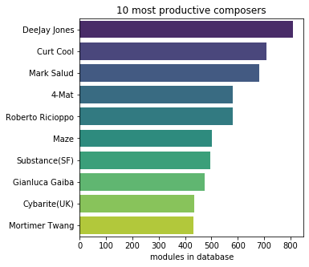

## Observation #04: Top 10 most productive composers

The top 10 most productive composers have over 400 modules int he database. The most productive 10 have composed altogether over 5700 modules!

|Rank| Composer | 
|--|----------|
|1.|[Deejay Jones](http://amp.dascene.net/detail.php?view=1727)| 
|2.|[Curt Cool](http://amp.dascene.net/detail.php?view=1412)| 
|3.|[Mark Salud](http://amp.dascene.net/detail.php?view=8070)| 
|4.|[Roberto Ricioppo](http://amp.dascene.net/detail.php?view=13249)| 
|5.|[4-mat](http://amp.dascene.net/detail.php?view=10)| 
|6.|[Maze](http://amp.dascene.net/detail.php?view=4741)| 
|7.|[Substance](http://amp.dascene.net/detail.php?view=7153)| 
|8.|[Gianluca Gaiba](http://amp.dascene.net/detail.php?view=3019)| 
|9.|[Cybarite](http://amp.dascene.net/detail.php?view=1418)| 
|10.|[Mortimer Twang](http://amp.dascene.net/detail.php?view=5078)| 

[TOC](ds_toc.md) | [Prev](ds_03.md) | [Next](ds_05.md)