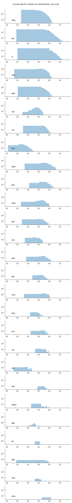

## Observation #05: Module size distribution per format

The following graphs show tracker format specific size/count distributions in the AMP database in logarithmic scale. 

What I found particularly interesting in this graph was that STK (the original Soundtracker format) appears to be from the
pre-chip era; pretty much all the other popular formats have high volume of small size modules. 

Another thing that sticks in the eye is the HUGE size variation (from the tiniest AHX of 123 bytes to whopping IT module of 50MB)

[TOC](ds_toc.md) | [Prev](ds_04.md) | [Next](ds_06.md)