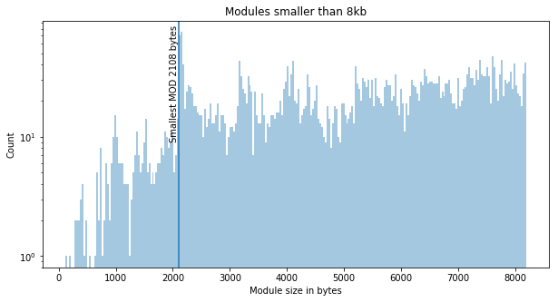

## Observation #06: The race for the smallest MOD

There are almost 5000 modules that are smaller than 8 kilobytes. The 
size distribution for small modules (all formats) is displayed below.

Size has always been one of the competitive factors in Demoscene productions.
I was still surprised by the amount of protracker MODs that target the 
minimum number of bytes possible on the format. There is a significant 
peak around 2112 bytes in the graph, and the shortest module is 2108 bytes.

There are two protracker mods that are exactly 2108 bytes in size. 

* [The Ultimate Beeper](http://amp.dascene.net/analyzer2.php?idx=28532) by Groo
* [7 Silent Secounds](http://amp.dascene.net/analyzer2.php?idx=26974) by Frequent

What is remarkable about **Groo**'s tune is that it has only zero length samples and you can still hear music. Playing the module requires using a real Amiga or 8bitbubsy's [PT2-Intel](https://16-bits.org/pt2.php) clone. It won't play on the regular LibOpenMPT based modern trackers. 

**Frequent**'s tune is, like the title indicates, silent. If you want to hear the composition, you'll need to load a sample in and then it is no longer as short as The Ultimate Beeper.

[TOC](ds_toc.md) | [Prev](ds_05.md) | [Next](ds_07.md)