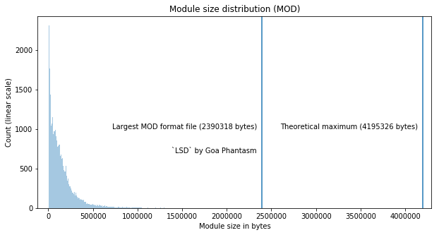

## Observation #07: The race(?) for the **largest** MOD

Theoretically the largest possible mod size is 4195326 bytes - 4Mb (see links at the bottom for details). However,
due to limitations of the conventional hardware, majority of the modules are small. The most common Amiga model, [A500](https://en.wikipedia.org/wiki/Amiga_500) only had 512Kb memory out of the box. The larger models like [A1200](https://en.wikipedia.org/wiki/Amiga_1200) could have up to 2Mb Chip RAM, but that's still 2Mb short of the maximum size dictated by the format. 

In this graph, you can see the MOD format module size distribution plot in linear scale, clearly displaying the bias towards chiptunes. To the right of the graph, the largest mod format file in the database is marked at 2.3Mb. This module, [LSD by Goa Phantasm](http://amp.dascene.net/downmod.php?index=118340), requires a version of ProTracker that can load samples larger than 64Kb to play back properly.

The rightmost vertical line on the graph shows the theoretical maximum size. Therefore, the questionable honor of creating the largest ever MOD file is still available.

Further reading:

* [Top 10 largest ProTracker modules ever made!](http://amp.dascene.net/forum/index.php?topic=384.0) - a thread at the [AMP](https://amp.dascene.net) Forum from 2012. This thread also touches the theoretical maximum size topic. Since the discusion, there has been three new entries to the top 10 (see list below).

* [environmental love](https://amp.dascene.net/downmod.php?index=125108) by Mr. C, 1.70 Mb
* [professionaltracker](https://amp.dascene.net/downmod.php?index=136444) by Hoffman, 1.67Mb
* [Miles From Home](https://amp.dascene.net/downmod.php?index=143227) by Acechan, 1.64Mb

* [Size limit for ProTracker Samples](https://modarchive.org/forums/index.php?topic=3235.0) - a thread at [modarchive.org](https://modarchive.org) forum (also from 2012) on the details of the max sample size for MOD files.

[TOC](ds_toc.md) | [Prev](ds_06.md) | [Next](ds_08.md)