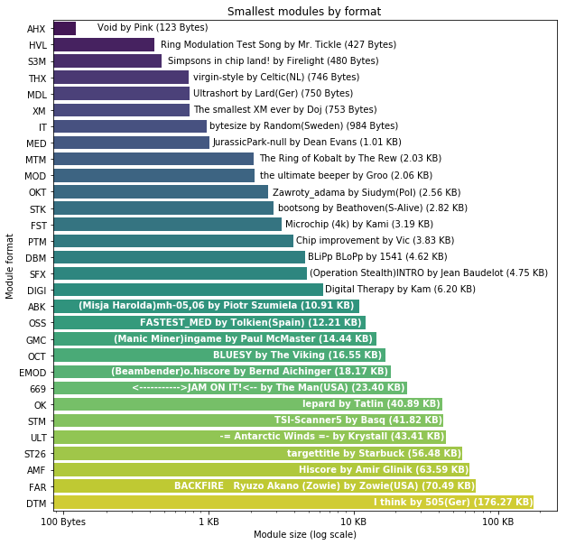

## Observation #08: Smallest modules by format

What are the smallest modules in other formats than MOD? In this graph, all the 4champ supported formats and the tiniest track available in each.

| format | module | size |
|--------|--------|------|
| AHX | [Void](https://amp.dascene.net/downmod.php?index=53366) by Pink | 123 Bytes |
| HVL | [Ring Modulation Test Song](https://amp.dascene.net/downmod.php?index=99805) by Mr. Tickle | 427 Bytes |
| S3M | [Simpsons in chip land!](https://amp.dascene.net/downmod.php?index=116978) by Firelight | 480 Bytes |
| THX | [virgin-style](https://amp.dascene.net/downmod.php?index=152896) by Celtic(NL) | 746 Bytes |
| MDL | [Ultrashort](https://amp.dascene.net/downmod.php?index=155030) by Lard(Ger) | 750 Bytes |
| XM | [The smallest XM ever](https://amp.dascene.net/downmod.php?index=16038) by Doj | 753 Bytes |
| IT | [bytesize](https://amp.dascene.net/downmod.php?index=119424) by Random(Sweden) | 984 Bytes |
| MED | [JurassicPark-null](https://amp.dascene.net/downmod.php?index=18826) by Dean Evans | 1.01 KB |
| MTM | [The Ring of Kobalt](https://amp.dascene.net/downmod.php?index=93907) by The Rew | 2.03 KB |
| MOD | [the ultimate beeper](https://amp.dascene.net/downmod.php?index=28532) by Groo | 2.06 KB |
| OKT | [Zawroty_adama](https://amp.dascene.net/downmod.php?index=109008) by Siudym(Pol) | 2.56 KB |
| STK | [bootsong](https://amp.dascene.net/downmod.php?index=120765) by Beathoven(S-Alive) | 2.82 KB |
| FST | [Microchip (4k)](https://amp.dascene.net/downmod.php?index=92323) by Kami | 3.19 KB |
| PTM | [Chip improvement](https://amp.dascene.net/downmod.php?index=93552) by Vic | 3.83 KB |
| DBM | [BLiPp BLoPp](https://amp.dascene.net/downmod.php?index=92) by 1541 | 4.62 KB |
| SFX | [(Operation Stealth)INTRO](https://amp.dascene.net/downmod.php?index=36655) by Jean Baudelot | 4.75 KB |
| DIGI | [Digital Therapy](https://amp.dascene.net/downmod.php?index=103556) by Kam | 6.20 KB |
| ABK | [(Misja Harolda)mh-05,06](https://amp.dascene.net/downmod.php?index=115187) by Piotr Szumiela | 10.91 KB |
| OSS | [FASTEST_MED](https://amp.dascene.net/downmod.php?index=147490) by Tolkien(Spain) | 12.21 KB |
| GMC | [(Manic Miner)ingame](https://amp.dascene.net/downmod.php?index=53675) by Paul McMaster | 14.44 KB |
| OCT | [BLUESY](https://amp.dascene.net/downmod.php?index=137221) by The Viking | 16.55 KB |
| EMOD | [(Beambender)o.hiscore](https://amp.dascene.net/downmod.php?index=99259) by Bernd Aichinger | 18.17 KB |
| 669 | [<----------->JAM ON IT!<--](https://amp.dascene.net/downmod.php?index=141765) by The Man(USA) | 23.40 KB |
| OK | [lepard](https://amp.dascene.net/downmod.php?index=145188) by Tatlin | 40.89 KB |
| STM | [TSI-Scanner5](https://amp.dascene.net/downmod.php?index=127080) by Basq | 41.82 KB |
| ULT | [     -= Antarctic Winds =-](https://amp.dascene.net/downmod.php?index=90417) by Krystall | 43.41 KB |
| ST26 | [targettitle](https://amp.dascene.net/downmod.php?index=64635) by Starbuck | 56.48 KB |
| AMF | [Hiscore](https://amp.dascene.net/downmod.php?index=156969) by Amir Glinik | 63.59 KB |
| FAR | [BACKFIRE   Ryuzo Akano (Zowie)](https://amp.dascene.net/downmod.php?index=113338) by Zowie(USA) | 70.49 KB |

[TOC](ds_toc.md) | [Prev](ds_07.md) | [Next](ds_09.md)