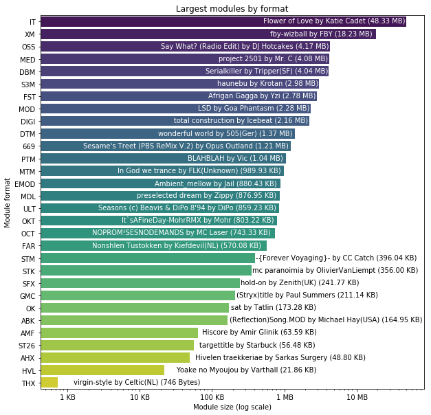

## Observation #09: Largest modules by format

Generally tracker music is lightweight in terms of the file size. Looking at the largest modules per each
tracker format shows that Impulse Tracker and FastTracker2 have inspired the composers to really push it. 

Bear in mind the logarithmic scale on the x axis, the 48.33 MB of the largest IT track is almost as 
much as the rest of the list together! 

Another thing worth noting: the largest THX module is also the smallest, there is only one in the AMP database. Same
goes for ST26 which probably denotes SoundTracker 2.6 release.

Whereas the smallest modules list is listening-wise a collection of short pieces, this list actually makes a 
pretty decent playlist. All the modules here are worth a listen.

| format | module | size |
|--------|--------|------|
| IT | [Flower of Love](https://amp.dascene.net/downmod.php?index=152197) by Katie Cadet | 48.33 MB |
| XM | [fby-wizball](https://amp.dascene.net/downmod.php?index=123074) by FBY | 18.23 MB |
| OSS | [Say What? (Radio Edit)](https://amp.dascene.net/downmod.php?index=98473) by DJ Hotcakes | 4.17 MB |
| MED | [project 2501](https://amp.dascene.net/downmod.php?index=43897) by Mr. C | 4.08 MB |
| DBM | [Serialkiller](https://amp.dascene.net/downmod.php?index=89661) by Tripper(SF) | 4.04 MB |
| S3M | [haunebu](https://amp.dascene.net/downmod.php?index=153280) by Krotan | 2.98 MB |
| FST | [Afrigan Gagga](https://amp.dascene.net/downmod.php?index=122221) by Yzi | 2.78 MB |
| MOD | [LSD](https://amp.dascene.net/downmod.php?index=118340) by Goa Phantasm | 2.28 MB |
| DIGI | [total construction](https://amp.dascene.net/downmod.php?index=32931) by Icebeat | 2.16 MB |
| DTM | [wonderful world](https://amp.dascene.net/downmod.php?index=122934) by 505(Ger) | 1.37 MB |
| 669 | [Sesame's Treet (PBS ReMix V.2)](https://amp.dascene.net/downmod.php?index=124182) by Opus Outland | 1.21 MB |
| PTM | [BLAHBLAH](https://amp.dascene.net/downmod.php?index=74291) by Vic | 1.04 MB |
| MTM | [In God we trance](https://amp.dascene.net/downmod.php?index=98788) by FLK(Unknown) | 989.93 KB |
| EMOD | [Ambient_mellow](https://amp.dascene.net/downmod.php?index=139895) by Jail | 880.43 KB |
| MDL | [preselected dream](https://amp.dascene.net/downmod.php?index=144074) by Zippy | 876.95 KB |
| ULT | [Seasons (c) Beavis & DiPo 8'94](https://amp.dascene.net/downmod.php?index=155715) by DiPo | 859.23 KB |
| OKT | [It`sAFineDay-MohrRMX](https://amp.dascene.net/downmod.php?index=42884) by Mohr | 803.22 KB |
| OCT | [NOPROM!SESNODEMANDS](https://amp.dascene.net/downmod.php?index=143790) by MC Laser | 743.33 KB |
| FAR | [Nonshlen Tustokken](https://amp.dascene.net/downmod.php?index=111436) by Kiefdevil(NL) | 570.08 KB |
| STM | [-{Forever Voyaging}-](https://amp.dascene.net/downmod.php?index=92079) by CC Catch | 396.04 KB |
| STK | [mc paranoimia](https://amp.dascene.net/downmod.php?index=96216) by OlivierVanLiempt | 356.00 KB |
| SFX | [hold-on](https://amp.dascene.net/downmod.php?index=104974) by Zenith(UK) | 241.77 KB |
| GMC | [(Stryx)title](https://amp.dascene.net/downmod.php?index=53679) by Paul Summers | 211.14 KB |
| OK | [sat](https://amp.dascene.net/downmod.php?index=145190) by Tatlin | 173.28 KB |
| ABK | [(Reflection)Song.MOD](https://amp.dascene.net/downmod.php?index=105987) by Michael Hay(USA) | 164.95 KB |
| AMF | [Hiscore](https://amp.dascene.net/downmod.php?index=156969) by Amir Glinik | 63.59 KB |
| ST26 | [targettitle](https://amp.dascene.net/downmod.php?index=64635) by Starbuck | 56.48 KB |
| AHX | [Hivelen traekkeriae](https://amp.dascene.net/downmod.php?index=136298) by Sarkas Surgery | 48.80 KB |
| HVL | [Yoake no Myoujou](https://amp.dascene.net/downmod.php?index=100962) by Varthall | 21.86 KB |
| THX | [virgin-style](https://amp.dascene.net/downmod.php?index=152896) by Celtic(NL) | 746 Bytes |

[TOC](ds_toc.md) | [Prev](ds_08.md) | [Next](ds_10.md)