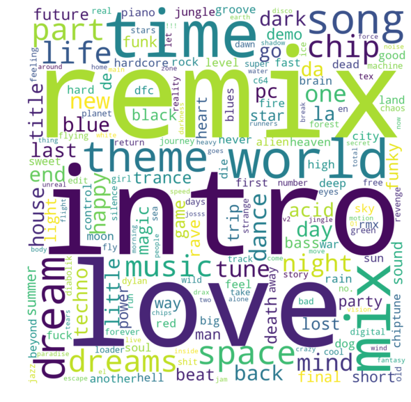

## Observation #10: A view to the module names

When modules are used in demos, they may remain unnamed in the demo texts but
every piece still has a name. In fact, in the whole 4champ database there is
only 40 modules that have the name 'untitled'.

You can put your finger on the composers' pulse here and see what are the most used words
in module names in the whole database. This wordcloud contains the 200 most frequent 
words that appear in the module names through the whole database. Size
of the word denotes the frequency. A set of most frequent words like *the*, *and*, *my* etc 
have been filtered out.

It shows out that love conquers all, but in the tracker scene Remix and Intro are even more prevalent.

[TOC](ds_toc.md) | [Prev](ds_09.md) | [Next](ds_11.md)