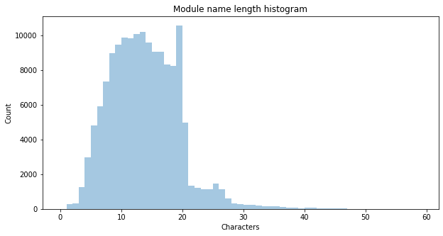

## Observation #11: Module name lengths

Module names are usually rather short. [MOD](http://coppershade.org/articles/More!/Topics/Protracker_File_Format/) format (the most common module format) has a limitation of 20 bytes for the name. Some tracker programs (like Protracker) reserve the last byte for null terminator, hence the peak at 19 characters. The second most common format [XM](https://www.fileformat.info/format/xm/corion.htm) (FastTracker) has also the limitation of 20 characters in the name, editors allow using the full length. 

In the histogram, you can see also a small peak at 25 characters ([Impulse tracker](https://github.com/schismtracker/schismtracker/wiki/ITTECH.TXT) files max module name length 26 including null termination). [S3M](https://formats.kaitai.io/s3m/index.html) modules have maximum song name length of 28 bytes including null terminator, and the name count peaks at 26 characters.

The length restriction applies only on the module internal data structure. The actual file name can be significantly longer, depending on the file system. Some other formats allow for much longer names also in the in-module structure (like [AHX](http://lclevy.free.fr/exotica/ahx/ahxformat.txt)).

The shortest names are naturally 1 character only, and the longest name in the database is 61 characters (including trailing/leading spaces. 

[TOC](ds_toc.md) | [Prev](ds_10.md) | [Next](ds_12.md)