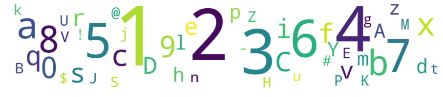

## Observation #12: Shortest module names

The shortest module names are naturally 1 character long (excluding the file format specifier extension). 
In this wordcloud, you can see all the one-character names, with the size of the character denoting the
count of occurrence.

While it is quite natural that numbers are the most common, the a-zA-Z alphabet is also pretty well represented,
with some exceptions. If you want to create a mod that has an unique single-character name, you can use a character
from this set: `o, w, y, F, G, I, L, N, O, Q, R, T, W, X`.

[TOC](ds_toc.md) | [Prev](ds_11.md) | [Next](ds_13.md)