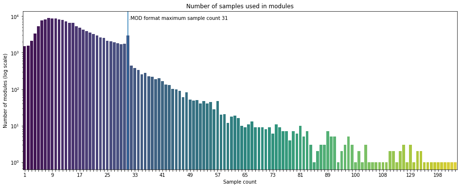

## Observation #14: Sample count distribution

Most of the Amiga Music Preservation modules are composed in trackers that make use of audio samples. There are some formats that rely on synthesis (e.g. THX, AHX, PRT). These formats are omitted from this graph. 

There are over 1500 modules that are built on a single sample or two samples. The most common number of samples used is eight (8). In the graph, you can see a small peak at 15 (Maximum number of samples in original SoundTracker (STK) module) and a rather significant one at 31 (Maximum for ProTracker module). After the peak at 31, the rest of the graph represents less than 3% of the whole database.

[TOC](ds_toc.md) | [Prev](ds_12.md) | [Next](ds_14.md)