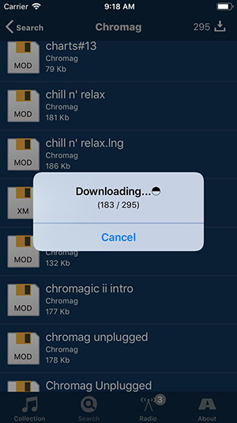
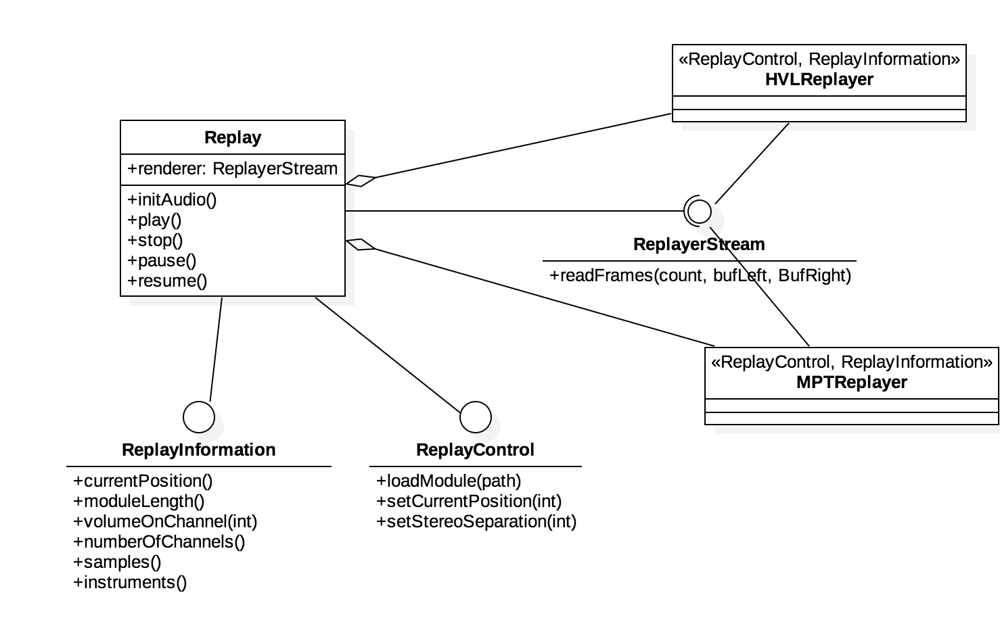
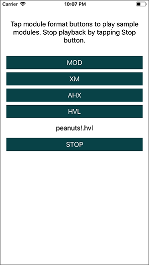

# 4champ Development Journal

### 13 August 2019 Download all mods by a composer

I attended [Datastorm 2019](https://datastorm.party) this year in the beginning of August, and during the party I managed to push a small new update to the repository. Now it is possible to download all modules by a composer on the Search view when you've selected a single Composer. By downloading the modules, you get to listen them in offline mode too, and in later updates it will be possible to build playlists of your local modules.

### 29 July 2019 Notification on new modules

One of the most useful features that I had on the AppStore version was the notification on new modules. It's always nice to check what's the latest additions in the database. Majority of the additions are new old stock that has been found, but every now and then there's also modern day tunes coming in from a demoscene event. 

The notification support is built using UserNotifications library, and is based on the app performing a background fetch to check for new items in database. In the event of new mods it will put up a local notification, and you can see the number of new mods in the badge on the app icon and on Radio tab in the 4champ UI.

### 15 June 2019 Local Collection view implementation

Ok so it took half a year but I finally got the time to squeeze the local collection implementation in. There are no fancy bells / whistles but when you search for mods or listen to 4champ radio, you can now mark modules for keeping by tapping the ⭐ button next to the module name in the "Now playing" area, Visualizer view or the Radio display. If you choose to unfavorite the module later, it will still be kept in the local collection until deleted.

While implementing this, I forgot that I had a cleanup function in the app that would delete all module files from application's documents directory at launch, to prevent unnecessary accumulation of files. When I ran the app first time with the original bundle identifier on my iPhone, the cleanup code wiped my whole collection (~5000 modules, about 1G of data). It was a moment of 🤯.  Now the implementation is safe, even if you install on top of the appstore version.

If you look carefully to the codebase, you'll notice that there is some indications of features that are not available, e.g. sharing. Most of the stuff is coming, and some might be dropped from the Swift version. 

The most notable feature yet to come is the support for playlists. After getting that done, the app is for most parts on par with the old AppStore Objective-C app. No promises, but I'm setting the end of year as deadline for that.

The Github project is now hooked up in [Codebeat](https://codebeat.co) static analysis platform, and every pull request (also my own) will get a scan for issues before it gets merged.  

### 30 November 2018 🎧Better headphones experience
I had the settings branch going for quite a time before merge. My intention was to require user to type in the AMP website domain name before downloading modules, if that would enable me to get the app listed on App Store again, but... no dice with Apple Review 😔. This was to be done through settings UI, which now only has control for stereo separation. 

### 4 October 2018 Bounty Bear Is Searching...

Over the past weeks I've dedicated a couple of evenings for 4champ, and the search feeature is ready to be shipped. Shipping here means merging from my development branch to master, since I'm still not taking my chances with Apple Review. That day is going to dawn but not yet.

When I originally started working with 4champ in 2012 it only supported search for module by name of the mod. The first AppStore release back in 2013 had  search by module or composer name. Later I added group search. The release 2.1 that did not pass Apple Review introduced search in module texts (i.e. sample / instrument names). All these search options are now available in the 4champ github repo master branch.

In addition to the search support, some minor improvements were made on the playback handling with headphones: The default stereo separation value is set to more headphone-friendly value, and playback is paused now when headphones are disconnected.

### 23 July 2018 Power on!
In the scorching heat wave we had in Finland in July 2018 it was too hot to go out, so I sat down near the air conditioning and put together the Radio feature basics. The option to store modules locally is not implemented yet, but you can listen to two 4champ radio channels: *All* plays tunes from the entire collection (as of today 149123 modules). *New* Plays most recently added tunes (which does not mean that they're new - most of the additions are older ones, but often around Demoscene party weekends there is a set of all fresh modules too). In addition to the basic audio playback, you can also now see volume bars visualisation and module internal texts by tapping the now playing area at the bottom of the screen when the radio is on. Yay!

### 12 June 2018 Setting up the scene for rewrite

As explained below, quite a bit of hours have been poured into the 4champ version 2.1 that never got out. However, coming back to the code after a significant break - we're talking a year or so, it just did not feel comfortable to continue from there, with all the legacy Objective-C code (some of it the very first lines of iPhone sw I ever wrote).

So a rewrite it is. I have a couple of google analytics hooks in the app store version, and looking at the figures it is pretty clear that where the app is still used it is mostly used for the radio feature. The average session duration is around half an hour, so for those who still use it, use it quite a bit.

Therefore I've decided to start with the radio feature. The first milestone is to get the radio feature + about page working, so that I can perhaps start to really dig into getting the app also back listed on the store. 

The first commit towards this target was done on June 12 and it was just the About view skeleton set up using Clean Swift templates. More to follow later.

### 21 April 2018 I can hear things
It was time for a rewrite on the replay routine that handles modules for 4champ. In the original app, playlist handling and replay were bundled in a single player class that used modplug to render the modules into audio stream. I wanted to avoid such tight coupling, and decided to implement the playing of modules in a way that allows for swapping the actual player libraries on the fly.

For now, I'm sticking with two libs: **libOpenMPT** and **HivelyTracker**. The first has a C++ interface, and the second is a C implementation. Since Swift does not have direct C/C++ interoperability, the Swift-facing Replay class and the library-specific wrappers are written in Objective-C. 

To test run my implementation I also wrote a very bare-bones sample mod player app that bundles a set of different types of modules that resides under 
SamplePlayer folder in the [4champ repository](https://github.com/sitomani/4champ/). You can try that out, just build the app in xcode and run in simulator or device. 

### 17 April 2018
Decided to start from the dependencies - I had LibOpenMPT integrated in my original project, but it was a very clumsy
hack. In fact, I did not remember quite exactly how I put the iOS build together and after updating to latest OpenMPT sources
from github I was facing some build errors.

Some tweaking with the OpenMPT Lua scripts and I could get the thing to work, somewhat. Premake5 official release does not work too well for iOS projects so it took a pbxproj file script hack to get it done, and building requires a manual step to add the dependency libraries to linking phase, but now I have it under my OpenMPT fork at [https://github.com/sitomani/openmpt](https://github.com/sitomani/openmpt).

Output from the build scripts in my fork repo is a fat binary for libopenmpt-small containing all the necessary architectures for 4champ. 

### 3 April 2018

These pages are created to document my development efforts and related endeavours around 4champ mod player app.
I hope publishing my progress here will inspire me to give the project a nudge more often than during past months.

As a first entry to this dev journal I guess it would make sense to introduce the project and the goals, 
as I have not pushed any code yet. Basically, I have two main goals for 4champ in 2018:

1. Rewrite the app in Swift. I'll write down the [history of 4champ](app_history.md) on a separate page where I'll
elaborate why I want to do the rewrite.
2. Find a way to get listed on AppStore again. The story about [why I had to remove 4champ from AppStore](appstore_removal.md) 
will also be posted on a separate page

